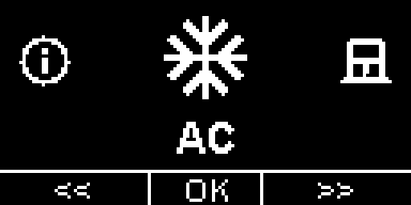
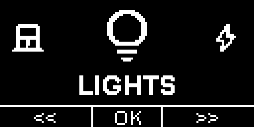
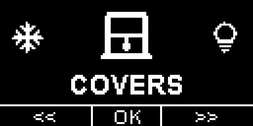
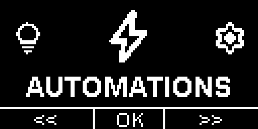
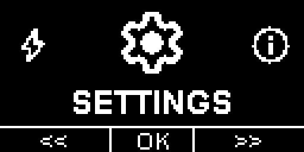
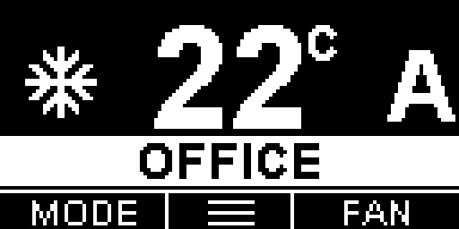
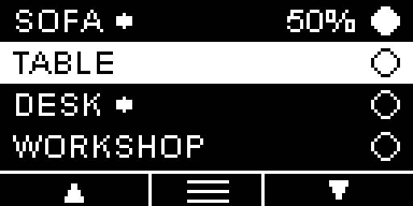
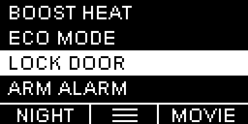
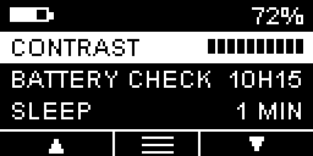

# ESPHome Multi-Function OLED Remote

ESP32-based wireless remote with a 128×64 OLED display. Controls AC units, lights, covers, and automations via Home Assistant. All display and interaction logic lives in C++ header files under `src/`; ESPHome YAML handles connectivity, sensors, and button wiring.

- Full project write-up: [tech.lugowski.dev/guides/smart-oled-remote](https://tech.lugowski.dev/guides/smart-oled-remote/)
- 3D-printed case: [MakerWorld](https://makerworld.com/en/models/1902607-home-assistant-esphome-remote-with-oled-display#profileId-2039332)
- ESPHome docs: [esphome.io](https://esphome.io/)

---

## Screenshots

| AC | Lights | Covers | Automations | Settings |
|:---:|:---:|:---:|:---:|:---:|
|  |  |  |  |  |
|  |  |  |  |  |

---

## Directory layout

```
esphome_remote/
├── README.md                           ← this file
├── tools/
│   └── screenshot.py                   ← OLED framebuffer → PNG converter
└── devices/
    ├── multi_function_remote/          ← current device (v2 hardware, 6-button pad)
    │   ├── remote.yaml                 ← production firmware  (edit substitutions at the top)
    │   ├── remote_demo.yaml            ← offline demo firmware (no HA/WiFi required)
    │   ├── secrets.yaml                ← WiFi credentials
    │   ├── Makefile                    ← CLI build targets
    │   ├── fonts/
    │   │   └── arial_bold.ttf
    │   ├── packages/                   ← ESPHome YAML sub-packages (one per controller mode)
    │   │   ├── menu.yaml
    │   │   ├── mode_ac.yaml
    │   │   ├── mode_lights.yaml
    │   │   ├── mode_covers.yaml
    │   │   ├── mode_automations.yaml
    │   │   ├── mode_settings.yaml
    │   │   ├── buttons.yaml            ← abstract btn_* dispatcher (v2 layout)
    │   │   └── layouts/
    │   │       ├── layout_v1.yaml      ← original AC board pinout (self-contained)
    │   │       └── layout_v2.yaml      ← 6-button generic layout (default)
    │   └── src/                        ← C++ controller classes and entity lists
    │       ├── menu_entities.h         ← ★ configure menu order / enabled controllers
    │       ├── ac_entities.h           ← ★ configure AC units
    │       ├── light_entities.h        ← ★ configure lights
    │       ├── cover_entities.h        ← ★ configure covers
    │       ├── automation_entities.h   ← ★ configure automations
    │       ├── *_controller.h          ← logic for each mode (no need to be modified!)
    │       ├── display_utils.h
    │       └── remote_core.h
    └── oled_remote/                    ← legacy device (v1 hardware, original AC board)
        └── README.md                   ← legacy notes
```

Files marked ★ are the ones you edit to match your Home Assistant setup.

---

## Hardware

| Component | Spec |
|---|---|
| MCU | ESP32 (`esp32dev`) |
| Display | SH1106 128×64 OLED, I2C |
| I2C pins | SDA GPIO27 · SCL GPIO25 |
| Wake pin | GPIO0 |
| Button pad | 6-button directional pad (v2) or original layout (v1) |
| Battery | LiPo with 100 kΩ/100 kΩ voltage divider on GPIO34 |

---

## Getting started

### 1. WiFi credentials

Fill in `devices/multi_function_remote/secrets.yaml`:

```yaml
wifi_ssid: "YourSSID"
wifi_password: "YourPassword"
```

### 2. API encryption key

ESPHome uses a 32-byte base64 key (not a HA long-lived access token) to secure the native API. Each device should have its own unique key.

Generate one:

```bash
python3 -c "import os, base64; print(base64.b64encode(os.urandom(32)).decode())"
```

Paste it into the `substitutions` block at the top of `remote.yaml`:

```yaml
substitutions:
  API_KEY: "paste_your_base64_key_here"
```

After flashing, HA will auto-discover the device. Go to **Settings → Devices & Services → ESPHome → Configure** and enter the same key — HA stores it for all future connections.

### 3. Configure your entities

Edit the `src/*_entities.h` files to match your Home Assistant setup (see [Entity configuration](#entity-configuration) below).

### 4. Flash the device

See [Building and flashing](#building-and-flashing) below.

---

## Building and flashing

### One-time setup

```bash
# Python 3.10+ required
python3 -m venv esphome-venv
source esphome-venv/bin/activate
pip install esphome

# Verify
esphome version
```

If `esphome` is not on your `$PATH`, edit the `ESPHOME` variable at the top of `Makefile`.

### Common commands

All `make` targets run from the `devices/multi_function_remote/` directory.

| Command | What it does |
|---|---|
| `make` | Compile production firmware |
| `make demo` | Compile demo firmware (no HA needed) |
| `make flash` | Compile + flash over USB (auto-detects port) |
| `make flash PORT=/dev/cu.usbserial-XXXX` | Flash to a specific USB port |
| `make ota IP=192.168.1.42` | Compile + flash over WiFi (OTA) |
| `make logs` | Open serial monitor |
| `make logs-ota IP=192.168.1.42` | Stream logs over WiFi |
| `make clean` | Remove build artefacts |

### First flash (USB)

Hold the **BOOT** button while pressing **RESET** to enter flash mode, then:

```bash
cd devices/multi_function_remote
make flash
# or with an explicit port:
make flash PORT=/dev/cu.usbserial-0001
```

After the first flash, subsequent updates can be done wirelessly:

```bash
make ota IP=<device-ip>
```

### Via Home Assistant ESPHome dashboard

1. Copy the `multi_function_remote/` folder into `/config/esphome/` on your HA instance:
   ```bash
   rsync -av devices/multi_function_remote/ ha:/config/esphome/multi_function_remote/
   ```
2. In the ESPHome dashboard click **+ New device → Import from file** and point it at `remote.yaml`.
3. Set `API_KEY` in the `substitutions` block and fill in `secrets.yaml`.
4. Hit **Install**.

---

## Taking screenshots (demo firmware only)

The demo firmware can dump the current OLED framebuffer as a monochromatic PNG via the serial port.

### Trigger

While the device is connected over USB, navigate to the screen you want to capture and **hold the Pause/Stop button for 3 seconds**. The device logs the raw framebuffer (1024 bytes, 128×64) as hex lines and immediately returns to normal operation.

### Capture and convert

```bash
# Install dependencies (one-time)
pip install pyserial pillow

# Live mode — stays connected, saves screenshot_<timestamp>.png on every capture
python3 tools/screenshot.py /dev/tty.usbserial-XXXX

# Or parse a previously saved serial log (single capture, then exit)
python3 tools/screenshot.py --file dump.log

# Custom upscale factor (default: 4× → 512×256 px)
python3 tools/screenshot.py /dev/tty.usbserial-XXXX --scale 6
```

### Options

| Flag | Default | Description |
|---|---|---|
| `--file / -f` | — | Parse a saved log file instead of opening a serial port (single capture, then exit) |
| `--baud / -b` | `115200` | Serial baud rate |
| `--output / -o` | `screenshot_<ts>.png` | Output path (file mode only; live mode always uses the timestamp name) |
| `--scale / -s` | `4` | Pixel upscale factor (4 → 512×256 px) |

---

## Enabling and disabling controllers

Open `src/menu_entities.h`. The `MENU_LIST` array controls which controllers appear in the carousel and in what order:

```cpp
static const MenuEntry MENU_LIST[] = {
  { APP_AC,          "\ueb3b", "AC"          },
  { APP_COVERS,      "\uec12", "COVERS"       },
  { APP_LIGHTS,      "\ue0f0", "LIGHTS"       },
  { APP_AUTOMATIONS, "\uea0b", "AUTOMATIONS"  },
  { APP_SETTINGS,    "\ue8b8", "SETTINGS"     },
};
```

- **Remove a row** — that controller disappears from the carousel. Its button handlers stay silent (`app_mode == APP_X` can never be reached).
- **Reorder rows** — carousel order changes; routing follows automatically.
- **Single controller** — the menu button is suppressed (nothing to switch to).

The `APP_*` constants are stable — YAML conditions never need changing regardless of which controllers are enabled.

---

## Entity configuration

### AC (`src/ac_entities.h`)

One entry per physical air-conditioner unit.

```cpp
static const char* AC_MODES_0[] = { "cool", "fan_only" };
static const char* AC_FAN_0[]   = { "low", "high" };

static const ACEntity AC_LIST[] = {
  {
    "Living",                    // display name (≤8 chars)
    "climate.living_room_ac",    // HA entity_id
    "living_room_ac_temp",       // ESPHome sensor id — current temperature
    "living_room_ac_mode",       // ESPHome text_sensor id — hvac_mode
    "living_room_fan_mode",      // ESPHome text_sensor id — fan_mode
    AC_MODES_0, 2,               // modes array + count
    AC_FAN_0, 2                  // fan_modes array + count
  },
  // add more units…
};
```

The sensor `id:` values must match entries in `packages/mode_ac.yaml`.
Supported modes: `cool`, `heat`, `dry`, `fan_only`, `heat_cool`, `off`.

### Lights (`src/light_entities.h`)

One entry per light or light group.

```cpp
static const LightEntity LIGHTS_LIST[] = {
  //  name      entity_id        state_sensor_id   brightness_sensor_id  dimmable
  { "Sofa",  "light.sofa",   "sofa_light",      "sofa_brightness",    true  },
  { "Table", "light.table",  "table_light",     nullptr,              false },
};
```

Set `dimmable: true` and provide a `brightness_sensor_id` for lights that support brightness. Use `nullptr` for on/off-only lights.

### Covers (`src/cover_entities.h`)

One entry per cover (blind, curtain, roller shutter, etc.).

```cpp
static const CoverEntity COVER_LIST[] = {
  //  name       entity_id                    state_sensor_id         position_sensor_id
  { "Living", "cover.living_room_curtain", "living_curtain_state", "living_curtain_pos" },
};
```

- `state_sensor_id` — text_sensor: `open`, `closed`, `opening`, `closing`, or `stopped`
- `position_sensor_id` — sensor: 0–100 % (0 = fully closed, 100 = fully open)

Both must match entries in `packages/mode_covers.yaml`.

### Automations (`src/automation_entities.h`)

One entry per automation, scene, script, or any triggerable HA entity.

```cpp
static const AutomationEntity AUTOMATION_LIST[] = {
  //  name           short    entity_id                service                slot
  { "Good Night", "NIGHT", "scene.good_night",     "scene.turn_on",      "L"     },
  { "Movie Time", "MOVIE", "scene.movie_time",     "scene.turn_on",      "R"     },
  { "Away Mode",  "AWAY",  "automation.away_mode", "automation.trigger", nullptr },
};
```

- `service` — HA service to call (`scene.turn_on`, `automation.trigger`, `script.turn_on`, etc.)
- `slot` — `"L"` or `"R"` pins the entry as a one-press bottom-bar shortcut; `nullptr` for list-only
- `short_name` — bottom-bar label for slotted entries (≤5 chars)

---

## Troubleshooting

**Device won't connect to WiFi**
- Verify credentials in `secrets.yaml`
- Try increasing `output_power` in `remote.yaml`

**Display not working**
- Check SDA/SCL wiring (GPIO27/GPIO25)
- Verify the display model (`SH1106` vs `SSD1306`) and I2C address (`0x3C`)

**Buttons not responding**
- Check pin assignments match your hardware revision (v1 vs v2 layout)
- Pins use internal pull-ups — button should connect GPIO to GND

**API connection fails after flashing**
- Make sure the `API_KEY` in `remote.yaml` matches what you entered in HA
- HA must be reachable from the ESP32 subnet

---

## Legacy device

The original single-purpose AC remote (`devices/oled_remote/`) uses a different board layout and an older single-file YAML approach. It is no longer actively developed.

→ See [`devices/oled_remote/README.md`](devices/oled_remote/README.md) for notes on that configuration.
